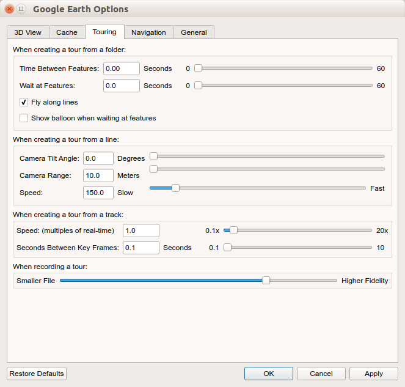
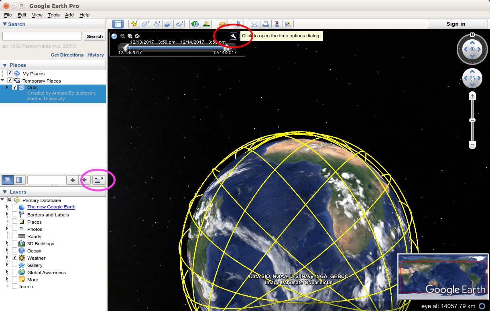
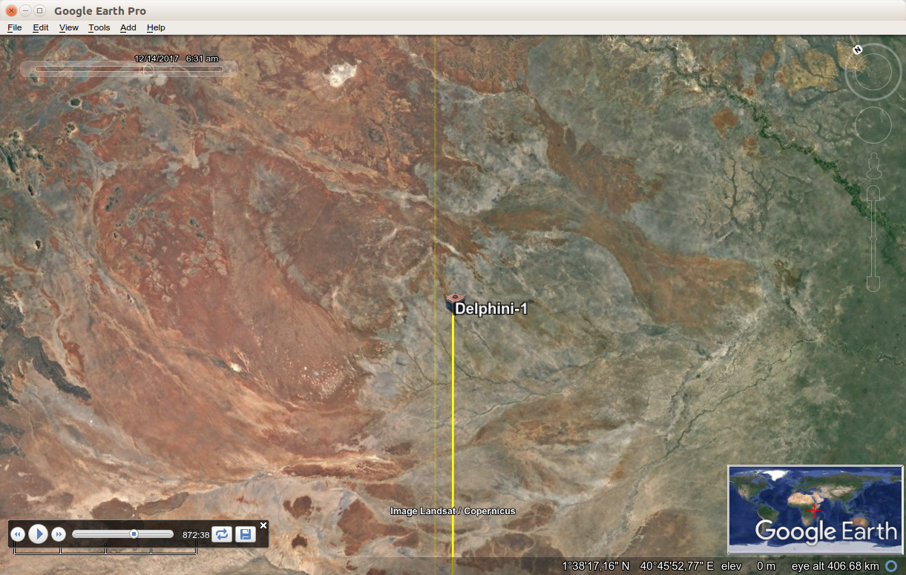

# Delphini-1 Project

This repository contains routines written by Anders Bo Justesen for the Delphini-1 Workshop 2 exam project. The repository contains files for two applications, the **Satellite Earth View** (SEV) and the **Satellite Map View** (SMV).

SEV shows a continuously updated view of Earth as it appears when looking straight down from the satellite. SEV is built for Google Earth Pro using the KML format.

SMV shows the satellite's current position on an interactive map. SMV is powered by Google Maps through the Google Maps Javascript API.

Both applications are based on orbital computations made with Python from the two-line element set.

----------

## Instructions for Satellite Earth View

Download and install [Google Earth Pro](https://earth.google.com/download-earth.html).

Under `Tools -> Options -> Touring`, use the following settings:



Create a KML file using the Python script `create_KML_file.py` (instructions inside) and open it with Google Earth.

Make sure that Google Earth is set to UTC time in the `Date and Time Options` by clicking the button highlighted in red:



To start SEV, press the `Play Tour` button highlighted in pink above. The view should look something like this (with the sidebar and tool bar hidden):



The SEV will start playing from the `startdate` specified in the KML file. To sync the SEV to a realtime view, simply navigate to the current date and time. 

It is possible to enable a daily updated cloud map, which will display accurate cloud information on the map. It is also possible to toggle a day/night view, which will make the Earth night side dark. Look for these options (and more) in the side bar under `Layers`.

----------

## Instructions for Satellite Map View

Make sure that `compute_coordinates` has execute permission.

Start `compute_coordinates` with a TLE file in the terminal, e.g.:
 `./compute_coordinates ISS.TLE`. Optionally use the `--verbose` flag to display the coordinates in the terminal.

With `compute_coordinates` running, simply open `SMV.html` in a web browser.


If you want to apply a different overlay on the map, change the `url` in `SMV.html` here:

``` /* Load KML layer from URL or local path */
  new google.maps.KmlLayer({
      map: map,
      url: 'https://www.google.com/maps/d/kml?mid=1919HD6uTNVHiKjLJFXtOXJqB00cuDFEe',
      preserveViewport: true
    }); ```
